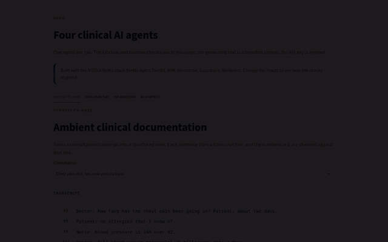
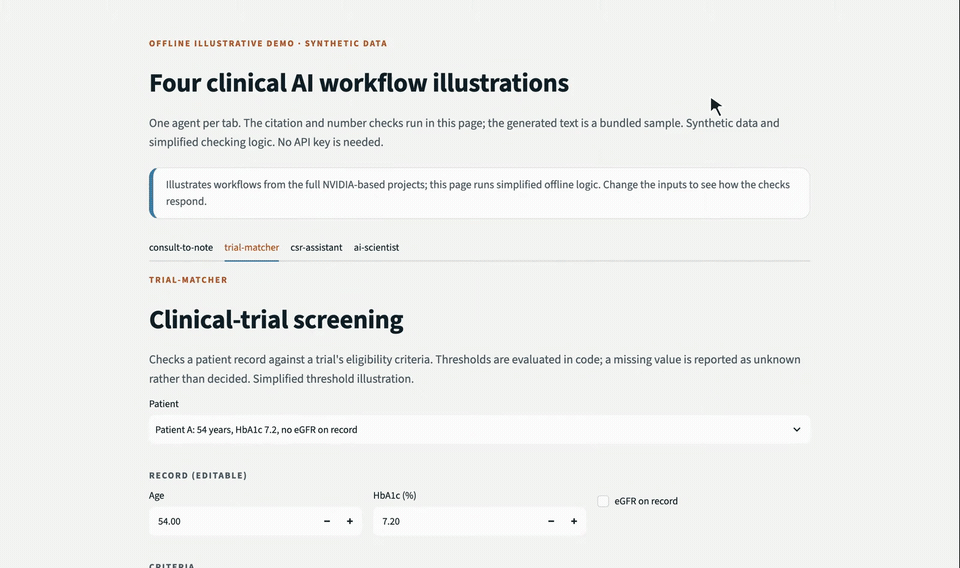
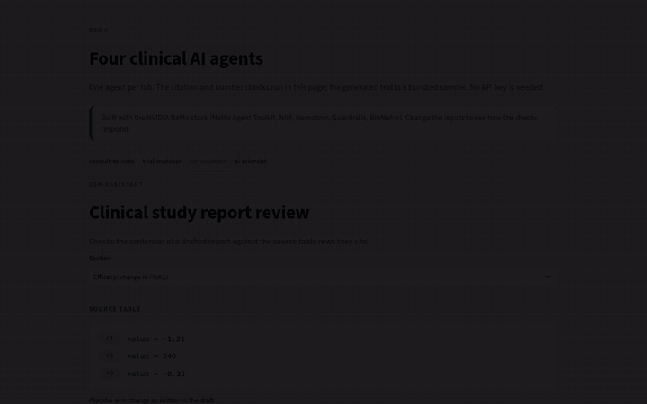
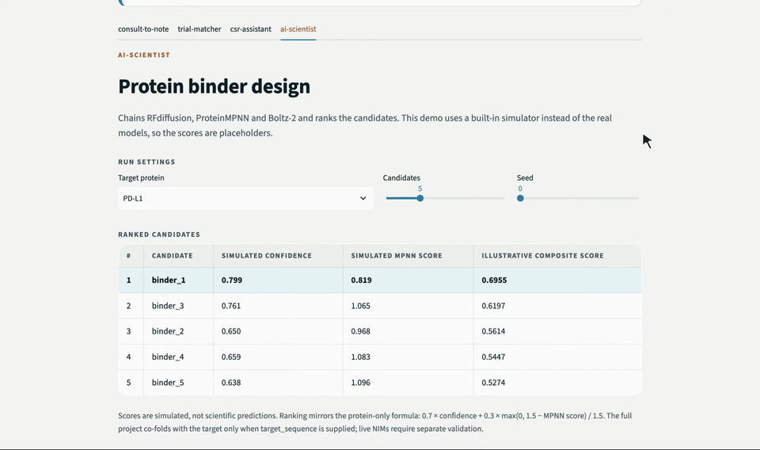

# Clinical Agentic AI, interactive demo

An interactive demo of four clinical AI agents built with the NVIDIA NeMo stack. In all four, the model
drafts, deterministic checks screen selected values, and human review is required before use.
The interactive illustration itself does not implement the full review workflows.

The demo uses simplified illustrative checking logic (number checks against a cited source, eligibility
thresholds, candidate ranking) on every input change. The generated clinical text is a bundled sample;
the full projects produce it with Nemotron, NeMo Agent Toolkit, NeMo Guardrails and BioNeMo.

## The four tabs

| consult-to-note | trial-matcher |
|---|---|
|  |  |
| **csr-assistant** | **ai-scientist** |
|  |  |

Full-quality videos are on [anhduongvo.github.io](https://anhduongvo.github.io/projects/clinical-agentic-ai/).

- **consult-to-note**: two consultations; the note's numbers are checked against the transcript, and an error can be planted to see it flagged.
- **trial-matcher**: two patients; thresholds are evaluated in code, a missing lab value is reported as unknown, and the record can be edited.
- **csr-assistant**: two report sections; each drafted sentence is checked against the table row it cites, and the flagged number can be corrected.
- **ai-scientist**: a simulated BioNeMo pipeline; change the target, seed and number of candidates to see the ranking update.

## Run locally

```bash
pip install -r requirements.txt
streamlit run app.py
```

## Deploy

- **Hugging Face Spaces**: create a new Space with SDK "Streamlit", push these files. The front matter above configures it. No secrets needed (offline demo).
- **Streamlit Community Cloud**: point it at this repo and `app.py`.

## Full projects

[consult-to-note](https://github.com/AnhDuongVo/consult-to-note) ·
[trial-matcher](https://github.com/AnhDuongVo/trial-matcher) ·
[csr-assistant](https://github.com/AnhDuongVo/csr-assistant) ·
[ai-scientist](https://github.com/AnhDuongVo/ai-scientist)

## License

Apache-2.0.


## Validation and scope

Six pure-function regression tests passed locally on Python 3.12. These check the demo's simplified number comparison, missing-value threshold, and repeatable ranking. They do not establish parity with the full applications. Install `requirements-dev.txt` and run `pytest -q`. The generated text is bundled, scores are placeholders, and human approval is illustrated rather than completed by this page.

## Numerical and ranking scope

The badge “Selected value matched” compares one supplied scalar, not every number or the meaning of a sentence. For blood pressure 148/92, the sample compares 148 only. Counts are exact; continuous CSR values allow an explicit absolute tolerance of 0.005. Other claims remain unchecked. This is an offline illustration, not ICH E3 document review.

Protein-only ranking mirrors the full project: `0.7 * confidence + 0.3 * max(0, 1.5 - mpnn_score) / 1.5`. All inputs are simulated; there is no affinity term. The full project co-folds a target only when `target_sequence` is supplied.

Previous README animations are retained in `old-videos/2026-10-10/`. Portfolio video backups are in the website repository’s `old-videos/2026-10-10/`.
